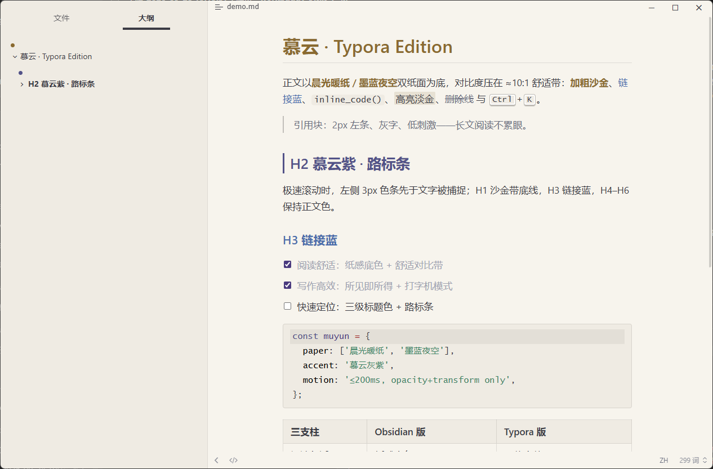
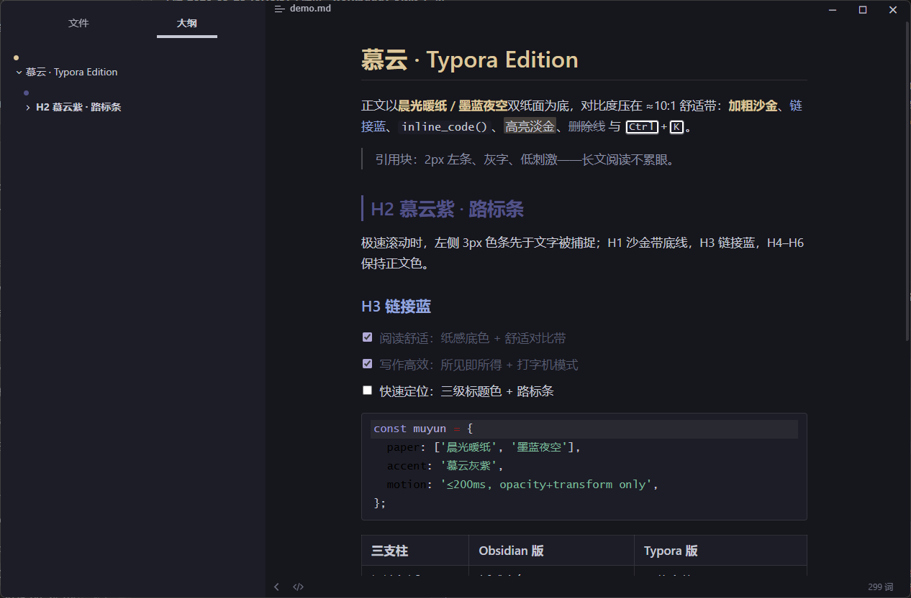

# MuYun 慕云 · Typora Edition

> The MuYun design (obsidian-muyun) ported to Typora — same paper surfaces, same anchor colors, same restrained motion. MuYun 设计的 Typora 移植版——同款纸面、同款锚点色系、同款克制动效。

**Light 晨光暖纸** → `muyun.css` · **Dark 墨蓝夜空** → `muyun-dark.css` · **Wide 宽幅** → `muyun-wide.css` · **Wide Dark 宽幅深色** → `muyun-wide-dark.css`

姊妹仓库：[obsidian-muyun](https://github.com/GarrettFynn/obsidian-muyun)（Obsidian 版，已上架社区目录）。Typora 版为纯 CSS、零脚本依赖；Typora 内建的打字机模式与专注模式补足 Obsidian 版需配套插件才能实现的写作向特性。

## Screenshots 截图

**Online preview 在线预览**（无需安装，结构模拟页）：**https://garrettfynn.github.io/typora-muyun/**

**Light · 晨光暖纸**

**Dark · 墨蓝夜空**

## Overview 概述

**EN** — MuYun (慕云, "admiring the clouds") is built on the same three pillars as its Obsidian sibling. **Reading comfort**: warm-paper and ink-night surfaces with body text tuned into a ≈10:1 contrast band instead of maximum contrast, every accent desaturated with its hue preserved. **Writing efficiency**: the WYSIWYG editor, source mode and export share one token set, so switching never causes visual jumps; Typora's built-in typewriter scrolling and focus mode cover what the Obsidian version needs a companion plugin for. **Quick navigation**: three-tier heading colors with an H2 wayfinder stripe, outline dots colored by heading level, a file tree with active markers and parent-chain highlight, search hit highlighting, and a restrained motion system (≤200ms, opacity/transform only, `prefers-reduced-motion` respected).

**中文** — MuYun（慕云）与其 Obsidian 姊妹版共享三大支柱。**阅读舒适**：晨光暖纸与墨蓝夜空两种纸感底色，正文对比度压在 ≈10:1 舒适带而非最大值，所有强调色降饱和并保留色相。**写作高效**：所见即所得、源码模式与导出共用同一套令牌，切换零视觉跳变；Typora 内建的打字机滚动与专注模式补齐 Obsidian 版需要配套插件的能力。**快速定位**：三级标题色 + H2 路标条、按层级着色的大纲圆点、带当前标记与父链高亮的文件树、搜索命中高亮，以及一套克制的动效体系（≤200ms、只动透明度与位移、尊重 `prefers-reduced-motion`）。

## Highlights ✨ 亮点

- **Three-tier heading colors · 标题三级色** — H1 amber with an underline / H2 mallow purple with a 3px wayfinder stripe / H3 link blue; H4–H6 stay neutral. H1 沙金带底线、H2 慕云紫带 3px 路标条、H3 链接蓝，H4–H6 保持正文色。
- **Navigation-aware sidebar · 导航感知侧栏** — outline dots colored by heading level, folder titles bolded, the active file marked with an accent bar, and hovering a deep file lights up its ancestor folders. 大纲层级圆点（金/紫/蓝）、文件夹加粗、当前文件左条，悬停深层文件时父链逐级亮起。
- **One palette everywhere · 全站同一调色板** — GFM alerts, code highlighting, math, selection, search hits and tags all derive from the same 11-color pool as the Obsidian version. GFM 提示块、代码高亮、公式、选区、搜索命中与标签全部取自与 Obsidian 版相同的 11 色池。
- **Print/PDF ready · 打印导出** — exporting always yields light paper with heading-orphan protection and repeating table headers, even in dark mode. 导出恒为白纸黑字：标题防孤行、表头跨页重复，暗色模式也不例外。
- **Optional switches · 可选开关** — table zebra stripes, image cards, heading auto-numbering and three contrast presets, all off by default, enabled by uncommenting one block. 表格斑马纹、图片卡片、标题自动编号与三档对比度，默认全关，取消注释即启用。
- **Zero dependencies · 零依赖** — pure CSS, no scripts, no external fonts; the dark and wide variants reuse the base files via `@import`. 纯 CSS、无脚本、无外部字体；深色与宽幅变体经 `@import` 复用基础文件。

## What carries over 设计映射

| Obsidian 版 | Typora 版 |
| --- | --- |
| 晨光暖纸 / 墨蓝夜空纸面 | `muyun.css` / `muyun-dark.css`（组件规则共用，深色只换令牌） |
| H1 沙金 / H2 慕云紫路标条 / H3 链接蓝 | 同款三级标题色 + H2 左侧 3px 路标条 |
| 加粗沙金 / 高亮淡金 / 标签灰紫淡底 | 同款 `strong` / `mark` / `#tag` |
| Callout 语义调色板（蓝紫/苔绿/慕云紫/陶土/暗红） | GFM alerts（note/tip/important/warning/caution）同源色 |
| 40rem 行宽（验收档） | 默认 40rem；`muyun-wide(-dark)` 变体 46rem，或改 `--muyun-measure` |
| 表格 hover 行高亮、勾选弹入、滚动条 hover 变强调色 | 同款 |
| PDF 导出强制白纸黑字 | 两态 `@media print` 均强制纸底 + 标题防孤行、表头跨页重复 |
| 动效 ≤200ms / reduced-motion 全关 | 同款纪律 |

Typora 专属补全：代码围栏与源码模式语法高亮取自 MuYun 调色板（慕云紫/苔绿/陶土/墨紫/沙金），**全部 CodeMirror 令牌类逐一接管**——内置 codemirror.css 的硬编码浅色（普通变量/对象键名为纯黑）不会泄漏，未识别令牌回落正文色；运算符与括号等结构符退后取灰，对象键名归链接蓝族、类型标注归沙金族。TOC 层级着色对应大纲色条（金/紫/蓝），快速打开选中行左条、专注模式弱化到 faint 而非死灰。

## Install 安装

**四个主题文件必须放在同一个 themes 目录**（`muyun-dark.css` 经 `@import` 复用 `muyun.css`，两个宽幅变体同理）。All four files must sit in the same themes folder — the variants import the base files.

- Windows：`%APPDATA%\Typora\themes\`（文件 → 偏好设置 → 外观 → 打开主题文件夹）
- macOS：`~/Library/Application Support/abnerworks.Typora/themes/`

放入后**重启 Typora**，在菜单 **主题 Theme** 选择：

| 菜单项 | 文件 | 说明 |
| --- | --- | --- |
| Muyun | `muyun.css` | 浅色 · 晨光暖纸 · 40rem |
| Muyun Dark | `muyun-dark.css` | 深色 · 墨蓝夜空 · 40rem |
| Muyun Wide | `muyun-wide.css` | 浅色 · 46rem 宽幅 |
| Muyun Wide Dark | `muyun-wide-dark.css` | 深色 · 46rem 宽幅 |

## Options 可选开关（默认关）

打开 `muyun.css` 搜「锦上添花批」——三个可选特性各为一个注释块，去掉注释标记即启用，重新包上即关闭：

- **S1 表格斑马纹**：偶数行微底（打印态经 `--muyun-hover: transparent` 自动豁免）。
- **S2 图片圆角卡片**：内容图片加细边框 + 8px 圆角 + 二级底色。
- **S4 标题自动编号**：H1→1 / H2→1.1 / H3→1.1.1，仅正文区；Typora 所见即所得无虚拟化，**编辑态即稳定计数**（优于 Obsidian 版的仅阅读视图）；启用后 `#write h2` 的高特异性规则会自动收起 H2 路标条，无需手动处理。
- **S4b 编号扩展 H4–H6**（可选增强，需先启用 S4）：前缀取极弱色，保持「H4–H6 退后」的层级原则。

**正文对比度三档**（默认标准档 ≈10:1，不启用任何块即为标准）：浅色在 `muyun.css`「正文对比度三档」注释区（柔和 `#55555F` / 扎实 `#2C2C33`），深色配套在 `muyun-dark.css` 末尾同名区块（柔和 `#AFB3C2` / 扎实 `#D6D8E0`），与 Obsidian 版同值。

**已内置（无需开关）**：大纲面板层级圆点（金/紫/蓝 = 标题色系，H4 以下取灰）、文件树三件套（文件夹加粗 / 当前项左条 / hover 渐亮 / 缩进引导线）、父链高亮（`:has()`，旧内核静默降级）；文件列表视图（去分隔线 / 摘要取灰 / 信息条 tab / 底栏与路径条 hover / 排序钮强调色 / 搜索面板输入框）、偏好设置与导出面板（导航选中左条 + 控件边框随令牌）、数学公式配色（TeX 源码定义紫 / 渲染式随正文 / 中缝预览条随二级底色）、输入光标随交互色（所见即所得 `caret-color` + 源码模式 3px 光标，仅改取色沿用官方宽度）；中西文自动加隙（`text-autospace`，Chromium 120+ 实测生效，代码区豁免保等宽）、汉堡菜单面板深化与键盘焦点环（`:focus-visible`）。

## Known Differences 与 Obsidian 版的已知差异

**做不到（Typora 能力边界）**：

- Callout 全 19 类语义色与折叠 — Typora 的 GFM alerts 上限 5 类且不可折叠（已按同源色配满 5 类）。
- 代码块行号 — Typora 围栏代码无逐行 DOM，纯 CSS 无法实现。
- 内联标题（文件名 2.0em 大标题）、嵌入 transclusion 样式、图谱配色 — Typora 无对应概念或 DOM。
- Style Settings 式图形开关界面 — Typora 无此机制，用文件内注释开关替代。
- 配套插件的阅读进度条、侧缘小地图、续读记忆 — 主题 CSS 无法注入 JS。

**反而更强（Typora 侧占优）**：

- 标题自动编号在编辑态即可稳定计数（Obsidian 版受实时预览虚拟化限制，仅阅读视图）。
- 打字机滚动与段落聚焦为 Typora 内建（Obsidian 版需配套插件）。

**有意为之**：

- H2 慕云紫双态同值（`#525288`），深底上偏暗是既定设计（路标条先于文字被捕捉）。
- PDF 导出恒为白纸黑字（与 Obsidian 版打印策略一致）。
- 界面铬件（侧栏/菜单/偏好设置）跟随 Typora 主题体系，不模拟 Obsidian 布局。

## FAQ

- **编号怎么开？** 见 Options 段 S4（默认关，去掉注释即启用；S4b 扩展 H4–H6 需先启用 S4）。
- **行宽怎么改？** 见 Notes 段（默认 40rem / Wide 变体 46rem / `--muyun-measure` 52rem）。
- **导出 PDF 为什么是白底？** 见 Known Differences「有意为之」（与 Obsidian 版打印策略一致）。

## Notes 说明

- 行宽：默认 40rem（验收档）；直接选 `Muyun Wide(-Dark)` 主题即 46rem，或改 `muyun.css` 顶部 `--muyun-measure` 至 52rem。
- 正文字号在 偏好设置 → 外观 → 字号 调整（17px 最接近 Obsidian 版 16.5px 的观感）。
- `muyun-dark.css` 依赖 Typora 自带的 `night/mermaid.dark.css`（官方内置，随应用分发）。
- 兼容性：父链高亮依赖 `:has()`（Typora 1.7+，旧版静默降级）；已在 Typora 1.14.x（Windows）实测。
- 可选开关见上方 Options 段（S1 斑马纹 / S2 图片卡片 / S4 自动编号 / 对比度三档，均默认关）。
- 已内置（无需开关）：大纲层级圆点、文件树三件套 + 父链高亮、文件列表与信息条、偏好设置/导出面板、数学公式配色、输入光标随交互色——明细见 Options 段「已内置」条目。
- 调色板与令牌对照见 [PALETTE.md](PALETTE.md)；版本历史见 [CHANGELOG.md](CHANGELOG.md)；结构模拟预览见 [preview/](preview/README.md)。
